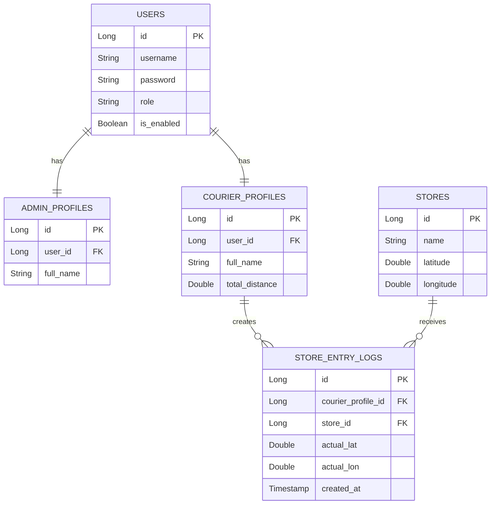

# Courier Tracking System

A real-time courier tracking backend designed to process high-frequency courier geolocation events, detect store visits using geofencing, and maintain courier distance efficiently.

The system uses **Apache Kafka** for asynchronous event ingestion, **Redis** for geospatial operations, caching and idempotency, and **PostgreSQL** for persistent relational data.

## Overview

The system is designed around a common logistics problem:

> How can a backend process frequent courier location updates without sending every update directly to the relational database?

The application separates the high-frequency processing path from persistent storage:

```text
Courier Location
       │
       ▼
    Kafka
       │
       ▼
 Kafka Consumer
       │
       ├──────────────► Redis GEO
       │                    │
       │                    ▼
       │              Geofence Check
       │
       ▼
 Redis Distance Buffer
       │
       ▼
 Scheduled Batch Flush
       │
       ▼
 PostgreSQL
```

This reduces unnecessary database writes while keeping PostgreSQL as the persistent source of application data.

---

## Key Features

### 1. Real-Time Geolocation Processing

* Asynchronous location-event processing using **Apache Kafka**
* Kafka retry handling
* Dead Letter Topic (DLT) support for failed messages
* Simulation API for generating courier movement events
* High-frequency event processing without synchronous database writes for every location update

### 2. Geospatial Processing

* Redis GEO for nearby-store lookups
* Geofence detection within a configured radius
* Redis TTL-based re-entry prevention
* Haversine formula for distance calculation
* Real-time distance accumulation

### 3. Efficient Persistence

Location processing does not require a PostgreSQL write for every event.

Distance increments are temporarily accumulated in Redis and periodically flushed to PostgreSQL in batches.

```text
Location Events
      │
      ▼
    Kafka
      │
      ▼
   Consumer
      │
      ▼
    Redis
  Distance Buffer
      │
      │ Scheduled Flush
      ▼
 PostgreSQL
```

This approach reduces database I/O and allows the system to handle a higher volume of location events.

### 4. Idempotency

Duplicate Kafka events can occur during retries or message redelivery.

The processing layer uses atomic checks to prevent the same event from being processed multiple times.

### 5. Re-Entry Prevention

A courier remaining inside the same store geofence should not continuously generate store-entry records.

Redis TTL-based state is used to implement a configurable re-entry window.

Example:

```text
Courier enters store
       │
       ▼
ENTRY recorded
       │
       ▼
TTL created
       │
       ▼
Courier remains inside
       │
       ▼
Additional entry ignored
       │
       ▼
TTL expires
       │
       ▼
Next valid entry can be recorded
```

### 6. Authentication & Authorization

* JWT-based authentication
* Role-based access control
* Admin and Courier roles
* Protected administrative endpoints
* Courier profile management

### 7. Monitoring

Spring Boot Actuator provides:

* Application health information
* Dependency health checks
* Application metrics

---

# Architecture

The system follows a layered Spring Boot architecture:

```text
                    ┌─────────────────────┐
                    │      REST API       │
                    └──────────┬──────────┘
                               │
                               ▼
                    ┌─────────────────────┐
                    │   Service Layer     │
                    └──────────┬──────────┘
                               │
              ┌────────────────┼────────────────┐
              │                │                │
              ▼                ▼                ▼
           Kafka            Redis           PostgreSQL
        Event Stream      Geo / Cache       Persistence
```

For location processing:

```text
Courier / Simulator
        │
        ▼
      Kafka
        │
        ▼
 Kafka Consumer
        │
        ├──────────────► Redis GEO
        │                    │
        │                    ▼
        │               Store Lookup
        │
        ├──────────────► Distance Buffer
        │
        ▼
   Processing Logic
        │
        ▼
 Scheduled Persistence
        │
        ▼
    PostgreSQL
```

---

# Technology Stack

| Category           | Technology                  |
| ------------------ | --------------------------- |
| Language           | Java 17                     |
| Backend            | Spring Boot 3.2             |
| Security           | Spring Security, JWT        |
| Messaging          | Apache Kafka, Zookeeper     |
| Cache / Geospatial | Redis                       |
| Database           | PostgreSQL                  |
| ORM                | Spring Data JPA             |
| Testing            | JUnit 5, MockMvc, H2        |
| API Documentation  | SpringDoc OpenAPI / Swagger |
| Containerization   | Docker, Docker Compose      |

---

# Database Design

The relational model contains users, courier profiles, administrators, stores and store-entry records.



---

# Engineering Decisions

## Why Kafka?

Location updates can arrive frequently and do not need to block the API request while the complete processing pipeline executes.

Kafka provides:

* Asynchronous processing
* Durable event storage
* Consumer-based processing
* Retry support
* Dead Letter Topics for failed events

```text
Location Event
      │
      ▼
    Kafka
      │
      ▼
  Consumer
      │
      ├── Success ──► Processing
      │
      └── Failure ──► Retry ──► DLT
```

## Why Redis?

Redis is used for operations where low latency is important:

* Geospatial lookups
* Temporary distance buffers
* TTL-based state
* Idempotency checks

This keeps frequently accessed transient state away from PostgreSQL.

## Why PostgreSQL?

PostgreSQL stores persistent business data such as:

* Users
* Courier profiles
* Stores
* Store-entry logs
* Persisted courier distance

The relational database provides durable storage and transactional guarantees for persistent data.

## Why Write-Behind Persistence?

Writing every location update directly to PostgreSQL can generate unnecessary database I/O.

Instead:

```text
Many Location Events
        │
        ▼
      Redis
        │
        ▼
   Batch / Scheduled
        │
        ▼
    PostgreSQL
```

This reduces the number of database operations generated by high-frequency location updates.

## Why Redis GEO?

Store proximity checks are a geospatial operation.

Redis GEO allows the application to perform nearby-location lookups without executing a relational geospatial query for every location event.

---

# API Overview

## Authentication

```http
POST /api/v1/auth/login
```

Returns a JWT token that can be used for authenticated requests.

## Courier Management

```http
POST /api/v1/couriers
```

Create a courier profile.

## Store Entries

```http
GET /api/v1/store-entries
```

Retrieve recorded store-entry events.

## Courier Distance

```http
GET /api/v1/couriers/{userId}/total-distance
```

Returns the courier's current total distance, including the real-time buffered value.

## Simulation

```http
POST /api/v1/simulation/journey
```

Generates a sequence of courier location events for testing the processing pipeline.

## Health

```http
GET /actuator/health
```

## Metrics

```http
GET /actuator/metrics
```

---

# Running Locally

## Prerequisites

* Java 17+
* Docker
* Docker Compose
* Maven

## 1. Start Infrastructure

```bash
docker-compose up -d --build
```

## 2. Run the Application

```bash
mvn spring-boot:run
```

The API will be available at:

```text
http://localhost:8080
```

Swagger UI:

```text
http://localhost:8080/swagger-ui/index.html
```

---

# Simulation

The project includes a simulation endpoint for generating courier movement events.

Example:

```json
{
  "userId": 2,
  "delayInSeconds": 2,
  "path": [
    {
      "latitude": 40.994500,
      "longitude": 29.126500
    },
    {
      "latitude": 40.993500,
      "longitude": 29.125500
    },
    {
      "latitude": 40.9923307,
      "longitude": 29.1244229
    },
    {
      "latitude": 40.9923307,
      "longitude": 29.1244229
    },
    {
      "latitude": 40.991000,
      "longitude": 29.123000
    }
  ]
}
```

The simulation can be used to observe:

1. Courier movement
2. Kafka event processing
3. Geofence detection
4. Re-entry prevention
5. Distance accumulation
6. Redis buffering
7. PostgreSQL persistence

---

# Testing

Run the test suite with:

```bash
mvn clean test
```

The project uses:

* JUnit 5
* MockMvc
* H2 for isolated database testing
* Testcontainers-ready infrastructure

---

# Failure Handling

The event-processing pipeline considers failures during asynchronous processing.

```text
Kafka Event
     │
     ▼
 Consumer
     │
     ├── Success ─────────► Continue
     │
     └── Failure
           │
           ▼
         Retry
           │
           ├── Success ──► Continue
           │
           └── Failure
                  │
                  ▼
                 DLT
```

This prevents repeatedly failing events from blocking normal event processing.

---

# Project Goals

The primary engineering goals are:

* Efficient high-frequency location processing
* Reduced database I/O
* Low-latency geospatial operations
* Duplicate-event protection
* Reliable asynchronous processing
* Persistent relational storage
* Clear separation between transient and durable state
* Observable backend services

---

# Future Improvements

Potential production-oriented extensions include:

* Redis Cluster
* Kafka consumer scaling
* Consumer lag monitoring
* Prometheus and Grafana
* Distributed tracing
* Circuit breakers
* Retry backoff strategies
* Kubernetes deployment
* Load testing
* Real-time WebSocket updates
* More advanced courier-to-route matching
* ETA calculation
* Driver/courier availability management

---

## License

This project is maintained for learning and engineering experimentation.
